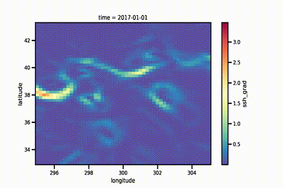
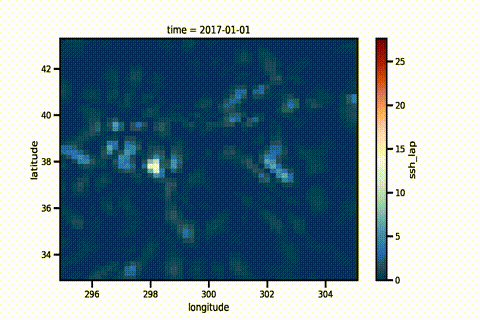

# Implicit Neural Representations for Interpolation

**Author**: J. Emmanuel Johnson

---
**Collaborators:**
* [Redouane Lguensat](https://redouanelg.github.io)
* [Julien Le Sommer](https://lesommer.github.io)
* [Ronan Fablet](https://rfablet.github.io)
* [Jordi Bolibar](https://jordibolibar.wordpress.com)
* Quentin Favre
* [Jean-Michel Brankart](https://www.ige-grenoble.fr/-Jean-Michel-Brankart-451-)
* Pierre Brasseur


---
## Overview


**Baseline Methods**: Optimal Interpolation

$$
\mathbf{x}^a = \mathbf{x}^b + \mathbf{K}\left(\mathbf{y}_{obs} - \mathbf{x}^b \right)
$$

**Standard Methods**: Kriging

$$
\mathbf{y} = \boldsymbol{\mu}(\mathbf{x}_\phi) + \mathbf{K}_\phi \left(\mathbf{y}_{obs} -  \boldsymbol{\mu}(\mathbf{X}_\phi)\right)
$$

**Modern Methods**: Implicit Neural Representations

$$
\mathbf{y}_{obs} = \boldsymbol{f}(\mathbf{x}_{\phi};\boldsymbol{\theta})
$$

---
## Results (Preliminary)

---
### QG Simulations (TODO)


#### Challenge

|      Simulated Altimetry Tracks      |       Simulated SSH Field        | 
|:------------------------------------:|:--------------------------------:|
|  |  |


#### Results

|              SSH Field              |           (Norm) Gradient           |          (Norm) Laplacian          | 
|:-----------------------------------:|:-----------------------------------:|:----------------------------------:|
|  |  |  |  

---
### OSE (Data Challenge 2021a)

#### Challenge

|          Altimetry Tracks           |                   SSH Field                   | 
|:-----------------------------------:|:---------------------------------------------:|
|   |  |


### Figures

|       Algorithm       |                   SSH Field                   |                  (Norm) Gradient                   |                   (Norm) Laplacian                   |
|:---------------------:|:---------------------------------------------:|:--------------------------------------------------:|:----------------------------------------------------:|
|     OI (Baseline)     |  |  |     |
| OI (DUACS-Production) |     |     |        |
|     SIREN (Ours)      |     |     |  |


### Statistics

|       Algorithm       | Normalized RMSE (Mean) | Normalized RMSE (Stddev) | Resolved Spatial Resolution (km) |
|:---------------------:|:----------------------:|:------------------------:|:--------------------------------:|
|     OI (Baseline)     |          0.85          |           0.09           |               140                |
| OI (DUACS-Production) |          0.88          |           0.07           |               152                |
|     SIREN (Ours)      |          0.88          |           0.08           |               136                |


#### Speed


|       Algorithm       | CPU (10 cores) | GPU (M1 MacOS) | GPU (V100, 16GB) | Multi-GPU (x4, V100, 16GB) |
|:---------------------:|:--------------:|:--------------:|:----------------:|:----------------------:|
|     OI (Baseline)     |      1 hr      |      ---       |       ---        |          ---           |
| OI (DUACS-Production) |      ---       |      ---       |       ---        |          ---           |
|     SIREN (Ours)      |    30 secs     |    15 secs     |      5 secs      |          ---           |


---
## Demos


---
## Installation Instructions


### Conda Environment (Preferred)

```bash
conda env create -f environments/torch_linux.yaml
```

### Pip Install (TODO)

```bash
pip install git+https://
```


### Download (TODO)

```bash
git clone https://
cd inr4ssh
pip install .
```


---
## Data Download

### Datasets

* 1.5 Layer QG Simulations
  * `94MB`
* SSH Data Challenge 2021a 
  * Train/Test Data - `116MB`
  * Results: BASELINE - ~`15MB`; DUACS - ~`4.5MB`
* SSH Data Challenge 2020b (TODO)
* SSH 5 Year Altimetry Tracks (TODO)

---
### Instructions

**Step 1**: Go into data folder

```bash
cd data
```

**Step 2**: Give permissions

```bash
chmod +x dl_dc21a.sh
```

**Step 3**: Download data (bash or python)

See the detailed steps below.

---
#### Option 1: Bash Script

**Run the bash script directly from the command line**

```bash
bash dl_dc21a.sh username password path/to/save/dir
```

---
#### Option 2: Python script + `credentials.yaml` (Preferred)

**Create a `.yaml` file**. You can even append it to your already lon `.yaml` file.

```yaml
aviso:
  username: username
  password: password
```

**Download with the python script**

```bash
python dl_dc21a.py --credentials-file credentials.yaml --save-dir path/to/save/dir
```

---
### Bonus: M1 MacOS Compatible 

I have included some environment files for the new M1 MacOS. This is because I personally use an M1 Macbook and I wanted to test out the new [PyTorch M1 compatability](https://pytorch.org/blog/pytorch-1.12-released/#prototype-introducing-accelerated-pytorch-training-on-mac) which makes use of the M1 GPU. I personally found that the training and inference time for using PyTorch are much faster. This coincides with other users experiences (e.g. [here](https://sebastianraschka.com/blog/2022/pytorch-m1-gpu.html)) In addition, Anaconda claims that other packages potentially get a [20 % speedup](https://www.anaconda.com/blog/apple-silicon-transition). To install, use the requirement file: 

```bash
mamba env create -f environments/torch_macos.yaml
```

**Differences**:
* The training scripts use the `skorch` distribution. This is because it takes advantage of the `M1` GPU and I have seen a substantial speed-up.
* A different environment file, i.e. `torch_macos.yaml`.

---
### Known Bugs

#### Datashader (Mac OS)

I cannot get datashader to work for the M1. But using the new [Anaconda distribution](https://www.anaconda.com/blog/new-release-anaconda-distribution-now-supporting-m1) works fine.

```bash
mamba create -n anaconda
mamba install anaconda=2022.05
```

---
## Acknowledgements

