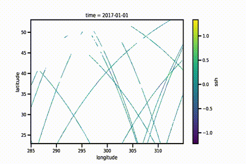
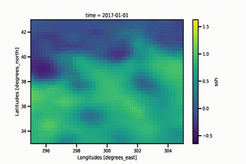
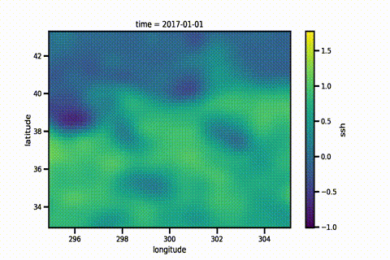
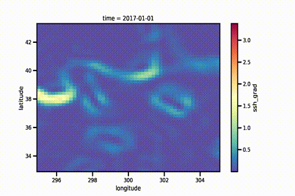
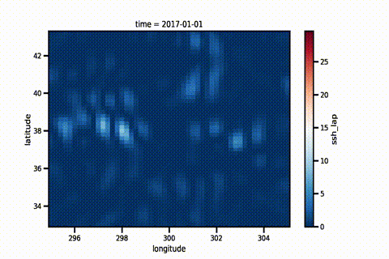
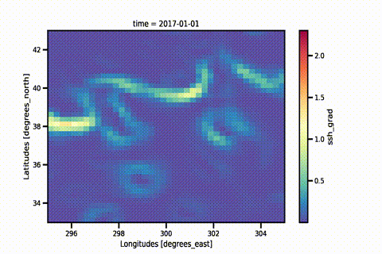
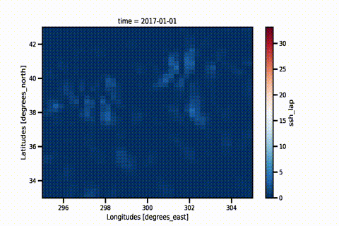
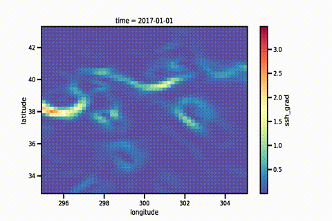
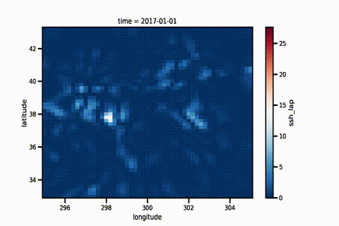

# OSE Data Challenge 2021a

### Overview

|          Altimetry Tracks           |                   SSH Field                   |
|:-----------------------------------:|:---------------------------------------------:|
|   |  |

### Figures

|       Algorithm       |                   SSH Field                   |                  (Norm) Gradient                   |                   (Norm) Laplacian                   |
|:---------------------:|:---------------------------------------------:|:--------------------------------------------------:|:----------------------------------------------------:|
|     OI (Baseline)     |  |  |     |
| OI (DUACS-Production) |     |     |        |
|     SIREN (Ours)      |     |     |  |

### Statistics

|       Algorithm       | Normalized RMSE (Mean) | Normalized RMSE (Stddev) | Resolved Spatial Resolution (km) |
|:---------------------:|:----------------------:|:------------------------:|:--------------------------------:|
|     OI (Baseline)     |          0.85          |           0.09           |               140                |
| OI (DUACS-Production) |          0.88          |           0.07           |               152                |
|     SIREN (Ours)      |          0.88          |           0.08           |               136                |

#### Speed

|       Algorithm       | CPU (10 cores) | GPU (M1 MacOS) | GPU (V100, 16GB) | Multi-GPU (x4, V100, 16GB) |
|:---------------------:|:--------------:|:--------------:|:----------------:|:----------------------:|
|     OI (Baseline)     |      1 hr      |      ---       |       ---        |          ---           |
| OI (DUACS-Production) |      ---       |      ---       |       ---        |          ---           |
|     SIREN (Ours)      |    30 secs     |    15 secs     |      5 secs      |          ---           |
